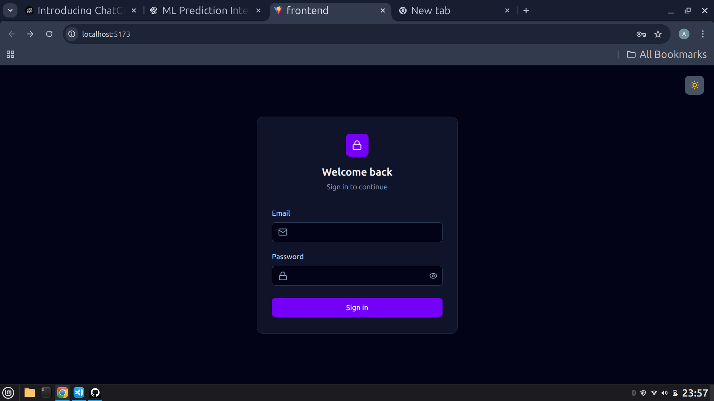
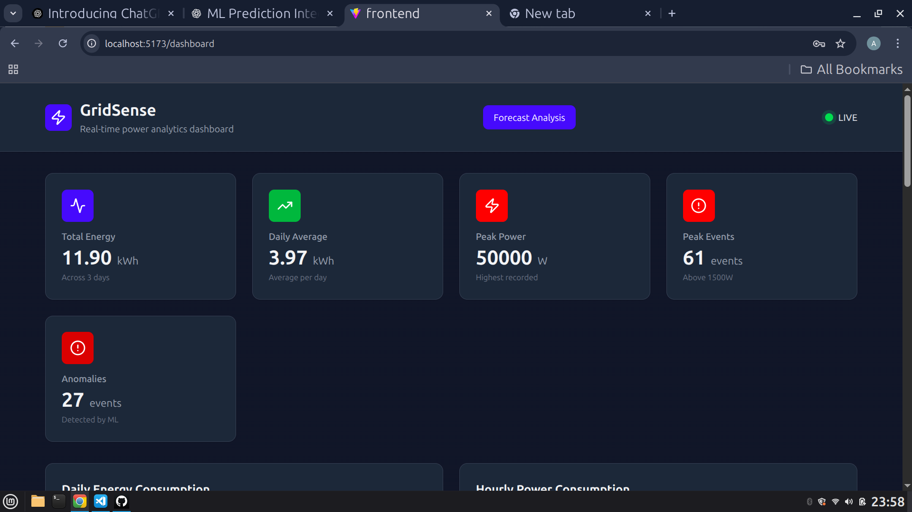
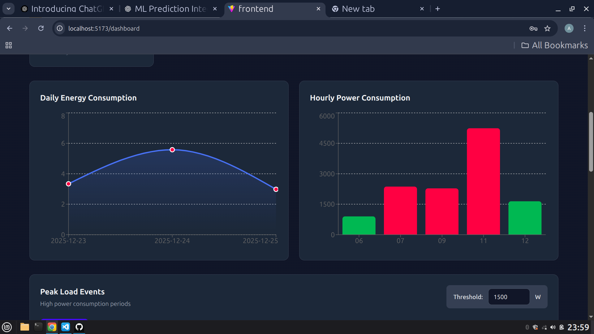
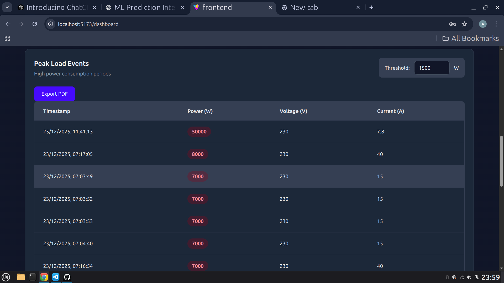
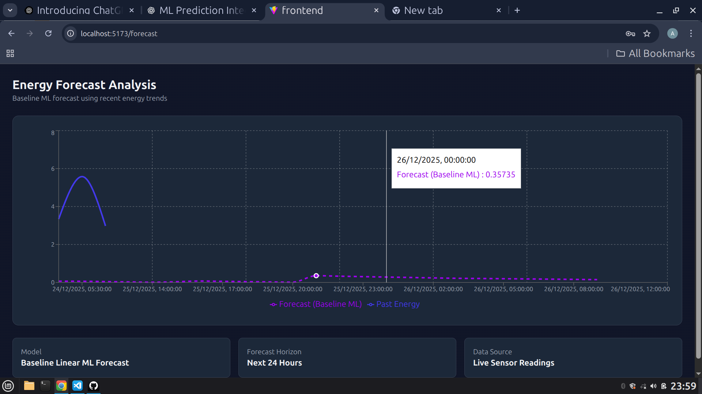
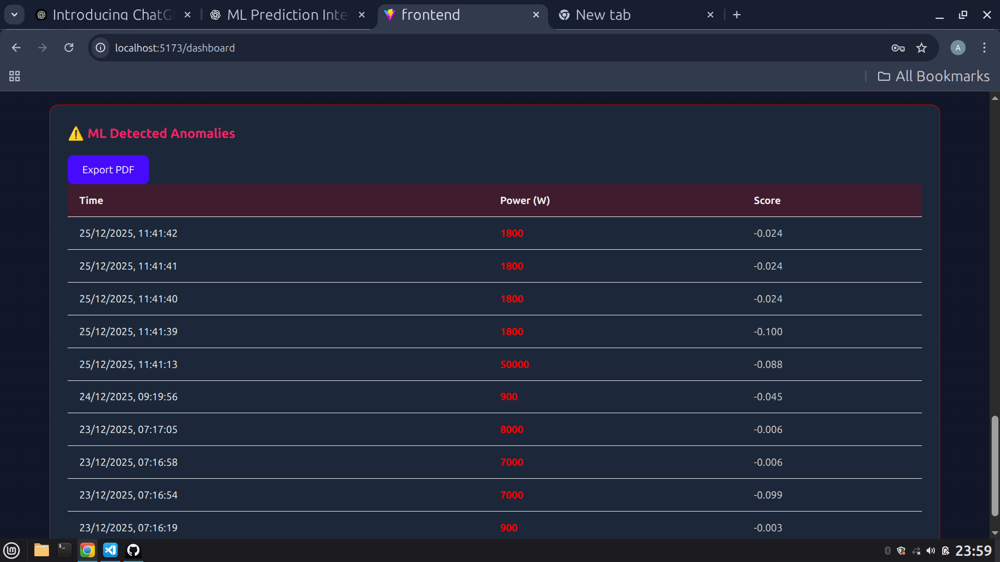

# ⚡ GridSense — Real-Time Energy Analytics & ML Forecasting Platform

GridSense is a full-stack energy monitoring and analytics platform that ingests live power readings, detects anomalies using machine learning, and generates short-term energy forecasts through an interactive dashboard.

The project focuses on **real-world backend engineering and explainable ML**, not toy demos or black-box models.

---

## 🚀 Key Features

### 🔐 Secure Data Ingestion
- JWT-protected REST APIs for ingesting power readings  
- Stores voltage, current, power, energy, and timestamps  
- **SQLite** used for persistent storage with a production-ready schema  

---

### 📊 Energy Analytics
- Daily energy consumption aggregation  
- Hourly average power analysis  
- Peak load detection with configurable thresholds  
- Historical analytics powered by SQL queries (no hardcoded data)  

---

### 🚨 ML-Based Anomaly Detection
- Uses **Isolation Forest** for anomaly detection  
- Rolling feature engineering on recent sensor data  
- Stores anomaly flags and scores in the database  
- Visual anomaly indicators on charts and tables  

---

### 🔮 Energy Forecasting (Machine Learning)
- Short-term (hour-level) energy forecasting  
- Lightweight **Linear Regression** model  
- Rolling statistical features:
  - Last observed energy  
  - Rolling mean energy  
  - Hour of day  
  - Weekend indicator  
- Forecasts generated **strictly for future timestamps**  
- Designed as a **baseline, explainable ML model**  

---

### 📡 Real-Time Updates
- WebSocket support for live power updates  
- Real-time dashboard refresh without polling  

---

### 📤 Data Export
- Export analytics tables (peak loads, anomalies) as **PDF**
- Designed for reporting and audit use cases  

---

## 🧠 Forecasting Design Philosophy

This project intentionally avoids over-complex models (LSTM, transformers) in favor of:

- Explainability  
- Stability with sparse real-world data  
- Easy debugging and reasoning  
- Interview-safe ML decisions  

The forecast iteratively predicts future energy values by feeding previous predictions back into the model using rolling statistical features.

---
## 📸 Screenshots

### 🔐 Authentication
**Light Mode**


**Dark Mode**


---

### 📊 Main Dashboard


---

### 📈 Energy Analytics & Graphs


---

### ⚡ Peak Load Analysis


---

### 🤖 ML-Based Forecasting
**Forecast View**


**ML Predictions Table**


## 🛠 Tech Stack

### Backend
- **FastAPI**
- **SQLAlchemy**
- **SQLite**
- **JWT Authentication**
- **WebSockets**
- **Pandas**
- **Scikit-learn**

### Frontend
- **React (Vite)**
- **Tailwind CSS**
- **Recharts**
- **Lucide Icons**

### Machine Learning
- Isolation Forest (Anomaly Detection)
- Linear Regression (Energy Forecasting)
- Time-series feature engineering

---

## 🔐 Security
- All analytics and forecasting endpoints are JWT-protected  
- Secure token-based access  
- Ready for role-based access control (RBAC)

---
## ⚙️ How to Run Locally

### 1. Clone the Repository
```bash
git clone https://github.com/your-username/gridsense.git
cd gridsense
```

###  2.Backend Setup
## 📈 API Endpoints (Core)
Create virtual environment
```
python -m venv venv
source venv/bin/activate   # Linux / Mac
venv\Scripts\activate      # Windows
```

Install Dependencies

```
pip install -r requirements.txt
```
Environment Variable

```
DATABASE_URL=sqlite:///./gridsense.db
SECRET_KEY=your_secret_key
ALGORITHM=HS256
ACCESS_TOKEN_EXPIRE_MINUTES=60
```

### 3.Frontend Setup

```
cd frontend
npm install
npm run dev
```

### Authentication Flow
 1. Login using /auth/login
 2. Store returned JWT token in frontend
 3. Include token in all protected requests:


### Core API Endpoints
| Endpoint                          | Description              |
| --------------------------------- | ------------------------ |
| `/auth/login`                     | User authentication      |
| `/analytics/daily-energy`         | Daily energy aggregation |
| `/analytics/hourly-average-power` | Hourly power analysis    |
| `/analytics/peak-loads`           | Peak load detection      |
| `/analytics/anomalies`            | ML-detected anomalies    |
| `/analytics/predict-energy`       | ML-based energy forecast |
| `/ws/live`                        | Real-time power updates  |


---
### 🗂 Project Structure

app/
 ├── analytics/
 ├── sensors/
 ├── auth/
 ├── ml/
 ├── ml2/
 ├── ws/
 ├── database.py
 └── main.py
frontend/
 ├── pages/
 ├── components/
 └── main.jsx


## 📖 What This Project Demonstrates
- End-to-end ML integration (training → inference → visualization)  
- Real backend engineering (authentication, database, WebSockets)  
- Handling real-world issues: sparse data, time alignment, auth blocking ML  
- Explainable ML over hype-driven models  
- Production-style API design and data persistence  

---

## 📌 Project Status
- Fully functional backend and frontend  
- Stable ML pipelines  
- SQLite persistence  
- Export functionality implemented  
- Designed for extensibility  

---

## 🚀 Future Enhancements
- Confidence intervals for forecasts  
- Scheduled model retraining  
- Email / SMS alerts for anomalies  
- Multi-sensor support  
- PostgreSQL migration for large-scale deployment  

---
---

## 👤 Author

**Adarsh Akshat**

- B.Tech (Electrical & Electronics Engineering)
- Interested in Backend Engineering, Systems Design & Applied Machine Learning
- Focused on explainable ML and production-grade backend systems

📍 India  
💻 GitHub: https://github.com/aadiakshat  

---

## 📜 License

This project is open-source and available under the **MIT License**.

You are free to use, modify, and distribute this project with attribution.

